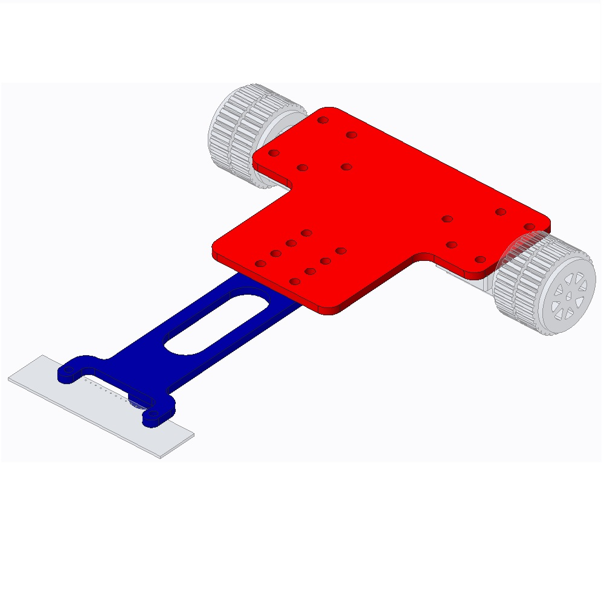
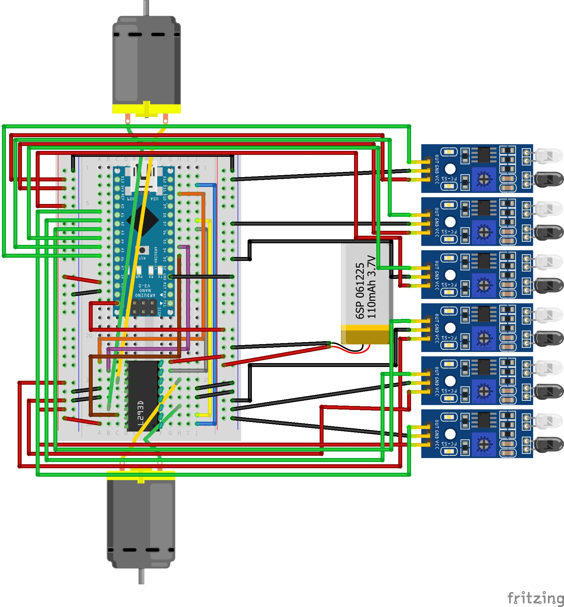
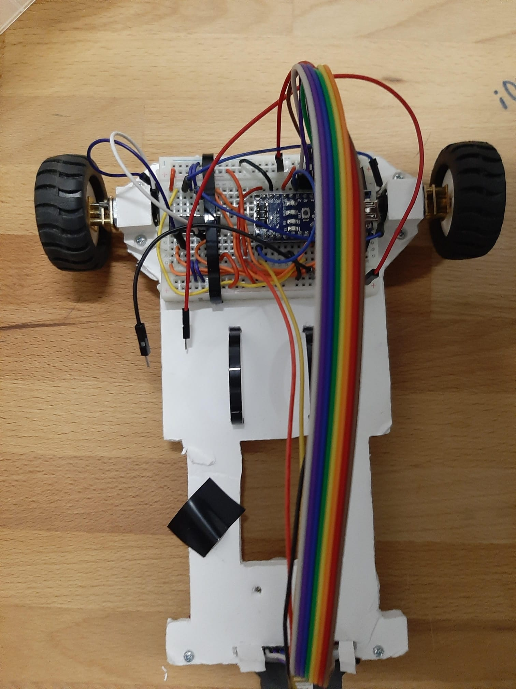
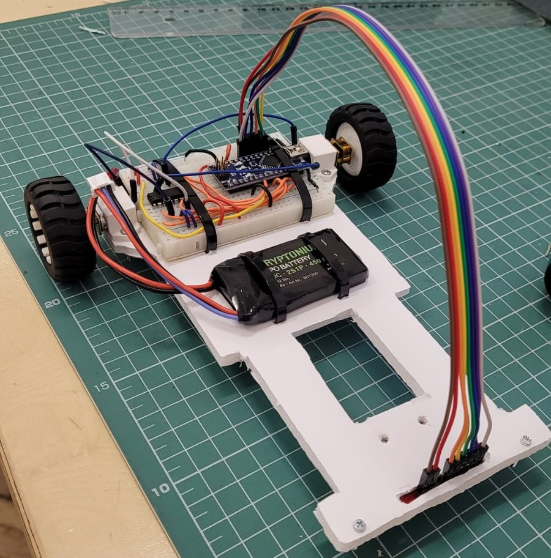
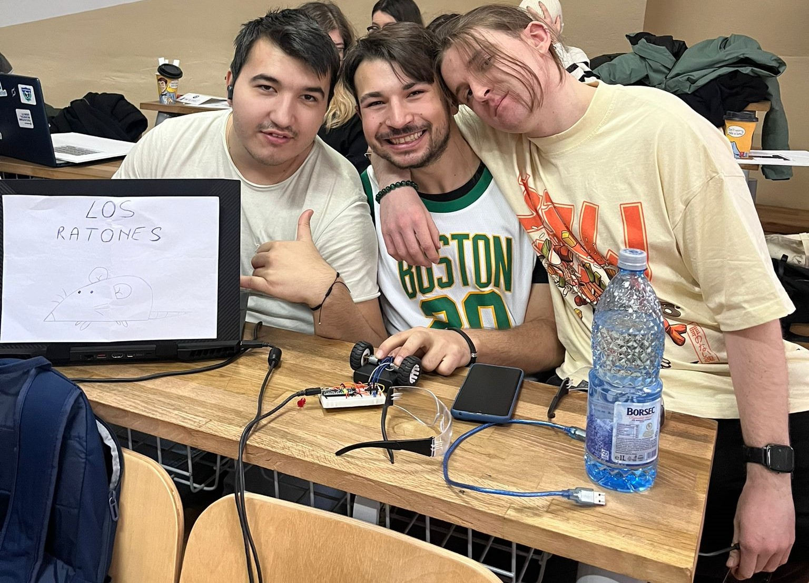

# LineFollower

This repository contains the steps we, team LOS RATONES, took in developing a fast and ergonomic Line Follower, with a simple and compact chassis, and an easy to understand code.

## The task?
By using an Arduino development board, build a Line Follower capable of completing the given track in under 20 sec. The chassis needs to be built by us entirely, the code needs to be tuned to finish the track in time.

## But how does it work?
A line follower is a type of robot whose sole purpose is to follow a thin black line on the ground, usually, it is shaped like a race car track, which in most cases is just a big rectangle made out of a white material with some black tape on it. The robot works by using an IR Sensor (Infrared Sensor) that can make a distinction between the white of the rectangle and the black of the tape by emitting and measuring infrared light, that is not visible to the human eye. By measuring how far the middle of the car is from the line the brain of the car (aka the Arduino) can decide how fast each wheel should spin, to take turns for example.

## Steps

### 1. Chassis design

We wanted a chassis that could be close to the ground and wide enough so that our little line-following robot would not drift out of the track and perform well in turns. So after a short search online we stumbled upon this nice example from [iFuture](https://ifuturetech.org/product/line-follower-robot-chassis/). We made the chassis from a foamboard-like material that could be strong enough to not bend under its weight while being light for better performance.

  
### 2. List of components

- Arduino Nano
    - We wanted a dev board that could be compact and that could fit on a half+ breadboard;
- L293D
    - The motor driver that we used is an IC (integrated circuit) that can handle 2 motors from 4.5 V up to 36 V, it is very cheap and easy to use.
- QTR-8A Reflectance Sensor Array
    - For the IR sensor we used an array of small sensors that can easily be mounted using some screws;
- Half+ breadboard
    - We managed to use this breadboard for the mounting of both the Arduino and the motor driver;
- 2 DC Motors with Gearbox
    - This kind of motor was easy to use and by using a gearbox it was fairly efficient in terms of speed;
- 2 Wheels
    - Wheels with rubber tires;
- LiPo Battery (Kryptonium 2S1P 12V)
    - Great lithium-polymer battery that gave our robot the power it needed;
- Wires
    - We used jumper wires for the whole build;

### 3. Electrical diagram

  
To be honest it is kinda hectic in there with all the wires but we didn't find the needed array of sensors in Fritzing so we used 6 independent sensors. The idea is the same.

### 4. Final Build

   
   

### 5. Code 

We used the Arduino IDE to program the little robot. We implemented a PID closed-loop control system alongside a Low Pass Filter to get the best results. More info in the [.ino file](https://github.com/GeorgePopescu318/LineFollower/tree/main/follower/follower.ino). 

Meanwhile, PID stands for Proportional, Integrative, and Derivative, each of these functions helps the car get better on the track and react better to change. In the end, we only used P, for reducing the error signal, which is the part of the system that gives it the main drive, and D, for ensuring that when changes in error occur, the system will behave accordingly and not just go out of the track because of inertia. Easier said, the P wants the car to go as fast as it can and D slows the car down so that it remains on the track.

### 6. Showcase
  

[__Link to the video__](https://drive.google.com/file/d/1HoKQnC8o8f6Li1FVwre6utV_q94SPJLr/view?usp=sharing)

### 7. Conclusion
 
After a whole day spent at University, blood, sweat, and tears, we finally had a working robot. Some issues we encountered were: positioning the IR Sensor backward, the autocalibration not working, and too much jiggle. But in the end, we made it work. We are proud of ourselves for being in the top 10, *or at least we think so*, with **18.2 sec**.

### 8. The team

### 🐭[Beselinho](https://github.com/Beselinho) 🎯[GeorgePopescu318](https://github.com/GeorgePopescu318) 👺[Vapus](https://github.com/Vapuss)

  